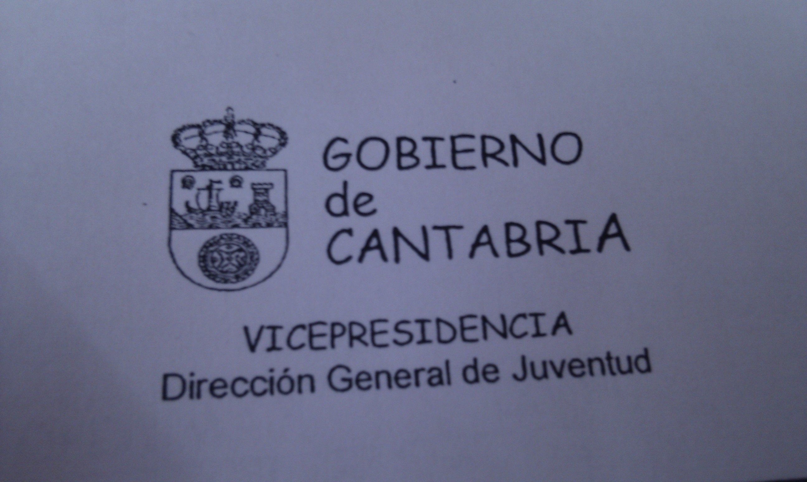
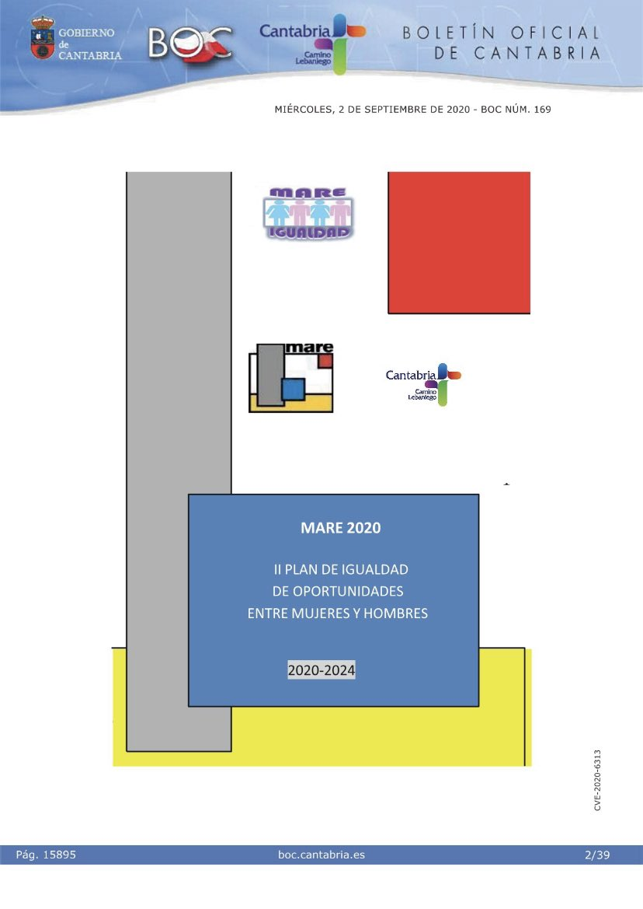

# gobierno-de-cantabria

En 2016 el Gobierno de Cantabria convocó un proceso participativo abierto a toda la ciudadanía, para renovar su imagen corporativa.

Un jurado valoró las propuestas recibidas y premió una, que fue seleccionada. Sin embargo, nunca más se supo nada del asunto. Casi una década después, en 2025, la imagen corporativa del Gobierno de Cantabria sigue siendo la misma.

Descargué las 102 propuestas recibidas y las preservo aquí, pues tanto la convocatoria del proceso participativo como las propuestas de la ciudadanía han desaparecido del portal institucional.

## Por qué

El Gobierno de Cantabria no cuida su marca, ni en el ámbito digital ni en los soportes físicos. A título de curiosidad, una vez me topé, en un documento oficial, con una cómica versión de la imagen institucional… ¡en Comic Sans! También es _kitsch_ la imagen corporativa de algunos organismos autónomos dependientes del Gobierno regional.

Ojalá el Gobierno de Cantabria renueve y cuide su marca, pues incide directamente en la percepción de la institución por parte de la ciudadanía y sus propios trabajadores.

|                      |                |
| -------------------- | -------------- |
|  |  |
